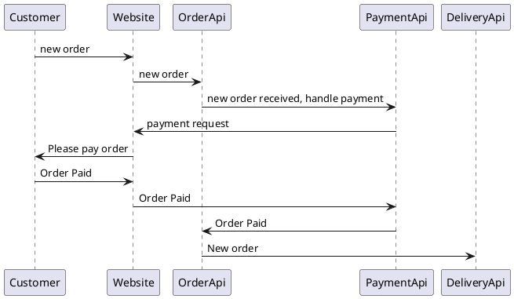

# Order Domain

The order domain is focussed on order handling. From receiving orders, validating orders. It will not be handling payments, nor deliveries.

The process will look a bit like this, we are still discussing about the details of the domain:

